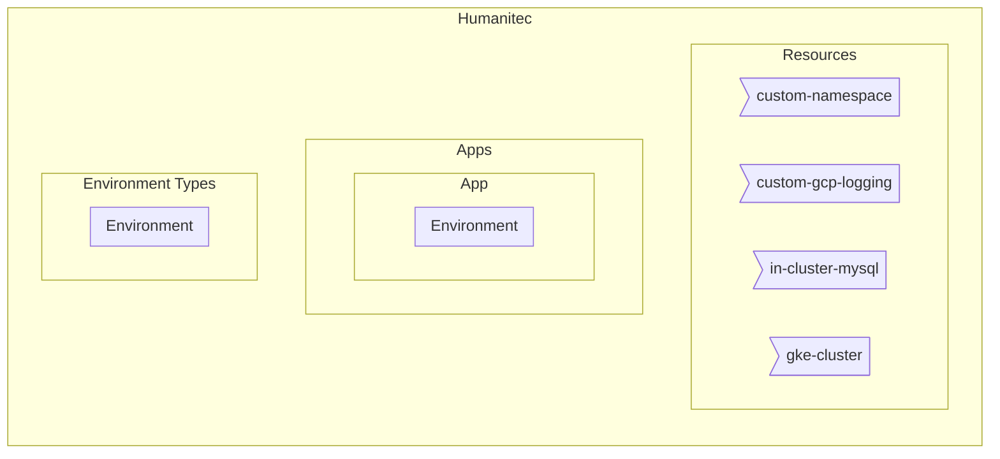
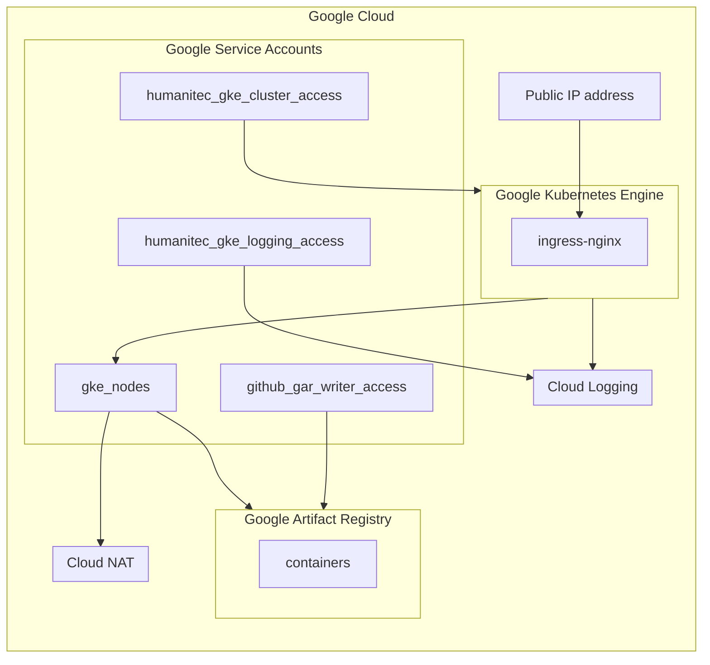
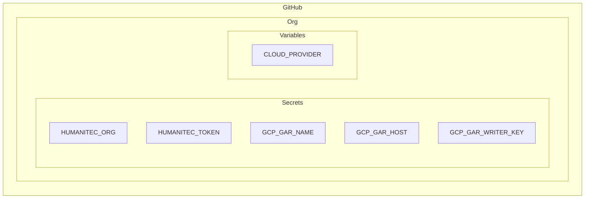

# [Beta] Google Cloud Reference Architecture for Humanitec

This is not yet the official Google Reference Architecture for Humanitec. This is currently tested as part of the Humanitec POV on Google Cloud. Feedback are more than welcome!

[](https://github.com/Humanitec-DemoOrg/google-cloud-reference-architecture/actions/workflows/ci.yaml)

In Humanitec:



In Google Cloud:



In GitHub:



For each Environment, just change this value:
```bash
HUMANITEC_ENVIRONMENT_TYPE=development
HUMANITEC_APP=FIXME

GITHUB_ORG=FIXME
GITHUB_REPOSITORY=FIXME
GITHUB_TOKEN=FIXME

GOOGLE_PROJECT_ID=FIXME
```

```bash
cd terraform

gcloud auth application-default login

terraform workspace new ${HUMANITEC_ENVIRONMENT_TYPE}
terraform workspace select ${HUMANITEC_ENVIRONMENT_TYPE}

terraform init -upgrade

terraform validate

terraform plan \
    -var humanitec_credentials="{\"organization\"=\"${HUMANITEC_ORG}\", \"token\"=\"${HUMANITEC_TOKEN}\"}" \
    -var humanitec_app_name=${HUMANITEC_APP} \
    -var github_credentials="{\"organization\"=\"${GITHUB_ORG}\", \"repository\"=\"${GITHUB_REPOSITORY}\", \"token\"=\"${GITHUB_TOKEN}\"}" \
    -var gcp_project_id=${GOOGLE_PROJECT_ID} \
    -var humanitec_env_type=${HUMANITEC_ENVIRONMENT_TYPE} \
    -out tfplan

terraform apply \
    tfplan
```