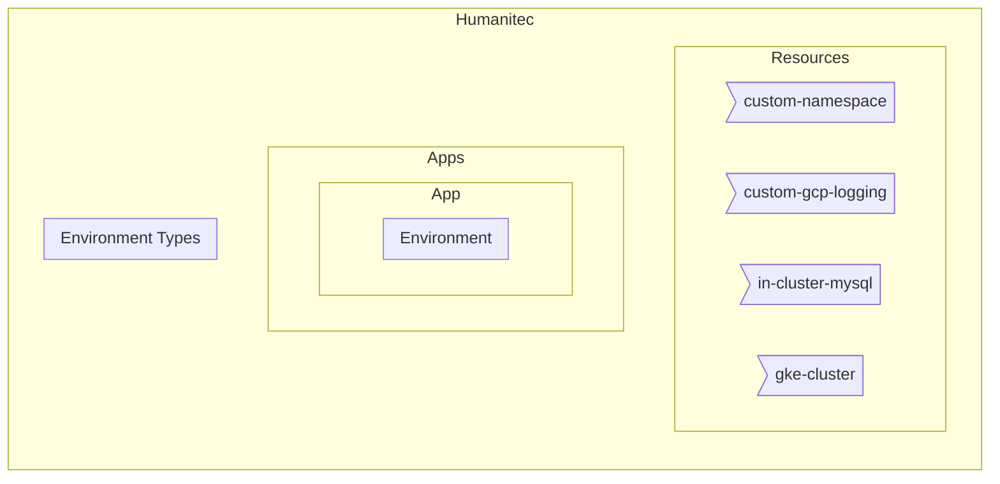

# google-cloud-reference-architecture

In Humanitec:



In Google Cloud:

FIXME

In GitHub:


For each Environment, just change this value:
```bash
HUMANITEC_ENVIRONMENT_TYPE=development
HUMANITEC_APP=FIXME

GITHUB_ORG=FIXME
GITHUB_REPOSITORY=FIXME
GITHUB_TOKEN=FIXME

GOOGLE_PROJECT_ID=FIXME
```

```bash
cd terraform/environment

gcloud auth application-default login

terraform workspace new ${ENVIRONMENT_TYPE}
terraform workspace select ${ENVIRONMENT_TYPE}

terraform init -upgrade

terraform plan \
    -var humanitec_credentials="{\"organization\"=\"${HUMANITEC_ORG}\", \"token\"=\"${HUMANITEC_TOKEN}\"}" \
    -var humanitec_app_name=${HUMANITEC_APP} \
    -var github_credentials="{\"organization\"=\"${GITHUB_ORG}\", \"repository\"=\"${GITHUB_REPOSITORY}\", \"token\"=\"${GITHUB_TOKEN}\"}" \
    -var gcp_project_id=${GOOGLE_PROJECT_ID} \
    -var humanitec_env_type=${HUMANITEC_ENVIRONMENT_TYPE} \
    -out tfplan

terraform apply \
    tfplan
```