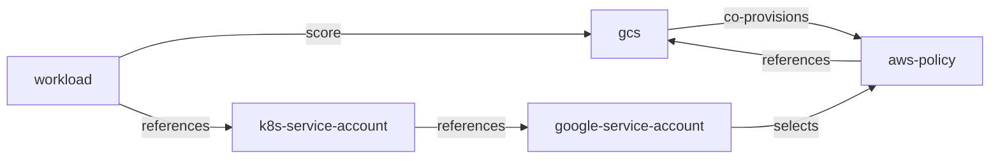

This GCS setup (i.e. `gcs` resource definition) needs other resource definitions:
- `workload`
- `k8s-service-account`
- `gcp-service-account`
- `config`
- `aws-policy` (temporary, by waiting for `gcp-iam-member`)

Remaining tasks:
- TODOS:
  - Avoid hard-coding the role in GSA TF
  - Change `aws-policy` by associated new GCP resource type (`gcp-iam-member`?)
  - ksa name in GSA (for WI binding) is assuming that this is the Workload name...
- Test with shared GCS
- Test with Operator (`k8s-cluster` ref won't work)
- Support read versus write roles
- Test with Workload without any GSA WI need
- Test with Workload with Spanner and GCS
- Test with Workload with 2 GCS

Targeted resource graphs:


Generated resource graph:

FIXME

```bash
cd resources/gcs-full
```

## Create the Humanitec App

```bash
APP=FIXME
```

```bash
humctl create app ${APP} \
    --name ${APP}
```

## Create the GSA to provision the Terraform resources

```bash
PROJECT_ID=FIXME
SA_NAME=humanitec-terraform
SA_ID=${SA_NAME}@${GSA_PROJECT_ID}.iam.gserviceaccount.com

gcloud iam service-accounts create ${SA_NAME} \
    --display-name=${SA_NAME} \
    --project 
gcloud projects add-iam-policy-binding ${PROJECT_ID} \
    --member "serviceAccount:${SA_ID}" \
    --role "roles/editor"
gcloud iam service-accounts keys create ${SA_NAME}.json \
    --iam-account ${SA_ID}
```

## Run Terraform locally

```bash
terraform init -upgrade

terraform validate

GCS_REGION=FIXME
GCS_PROJECT_ID=FIXME
NAMESPACE=namespace
WORKLOAD=workload
KSA=ksa

terraform plan \
    -var credentials="$(cat ${SA_NAME}.json | jq -r tostring)" \
    -var project_id=${GCS_PROJECT_ID} \
    -var region=${GCS_REGION} \
    -var namespace=${NAMESPACE} \
    -var workload=${WORKLOAD} \
    -var ksa=${KSA} \
    -out tfplan

terraform apply \
    tfplan
```

## Create the associated resource definitions in Humanitec

```bash
HUMANITEC_ORG=FIXME
HUMANITEC_TOKEN=FIXME
```

### Create the App's `config` resource definition

```bash
PROJECT_ID=FIXME
REGION=FIXME

ENVIRONMENT=development
```

```bash
cat <<EOF > ${APP}-${ENVIRONMENT}-config.yaml
apiVersion: entity.humanitec.io/v1b1
kind: Definition
metadata:
  id: ${APP}-${ENVIRONMENT}-config
entity:
  name: ${APP}-${ENVIRONMENT}-config
  type: config
  driver_type: humanitec/template
  driver_inputs:
    values:
      templates:
        outputs: |
          project_id: ${PROJECT_ID}
          region: ${REGION}
    secrets:
      templates:
        outputs: |
          credentials: '$(cat ${SA_NAME}.json | jq -r tostring)'
  criteria:
    - app_id: ${APP}
      env_id: ${ENVIRONMENT}
      res_id: app-config
EOF

humctl apply \
    -f ${APP}-${ENVIRONMENT}-config.yaml
```

### Create the `gcs` resource definition

Define the `gcs` resource definition:
```bash
cat <<EOF > gcs-full.yaml
apiVersion: entity.humanitec.io/v1b1
kind: Definition
metadata:
  id: gcs-full
entity:
  name: gcs-full
  type: gcs
  driver_type: humanitec/terraform
  driver_inputs:
    values:
      append_logs_to_error: true
      source:
        path: resources/gcs-full
        rev: refs/heads/rework
        url: https://github.com/Humanitec-DemoOrg/google-cloud-reference-architecture.git
      variables:
        project_id: \${resources['config.default#app-config'].outputs.project_id}
        region: \${resources['config.default#app-config'].outputs.region}
    secrets:
      variables:
        credentials: \${resources['config.default#app-config'].outputs.credentials}
  provision:
    aws-policy:
      is_dependent: false
      match_dependents: true
  criteria:
    - {}
EOF

humctl apply \
    -f gcs-full.yaml
```

### Create the `aws-policy` resource definition

```bash
cat <<EOF > gcs-admin-iam-member.yaml
apiVersion: entity.humanitec.io/v1b1
kind: Definition
metadata:
  id: gcs-admin-iam-member
entity:
  name: gcs-admin-iam-member
  type: aws-policy
  driver_type: humanitec/template
  driver_inputs:
    values:
      templates:
        outputs: |
          resource_name: \${resources.gcs.outputs.name}
  criteria:
  - {}
EOF

humctl apply \
    -f gcs-admin-iam-member.yaml
```

### Create the `gcp-service-account` resource definition

```bash
cat <<EOF > gsa.yaml
apiVersion: entity.humanitec.io/v1b1
kind: Definition
metadata:
  id: gsa
entity:
  name: gsa
  type: gcp-service-account
  driver_type: humanitec/terraform
  driver_inputs:
    values:
      append_logs_to_error: true
      source:
        path: resources/gsa
        rev: refs/heads/rework
        url: https://github.com/Humanitec-DemoOrg/google-cloud-reference-architecture.git
      variables:
        project_id: \${resources['config.default#app-config'].outputs.project_id}
        iam_member_resource_names: \${resources.workload>aws-policy.outputs.resource_name}
        res_id: \${context.res.id}
        workload_identity:
          gke_project_id: \${resources.k8s-cluster.outputs.project_id}
          namespace: \${resources.k8s-namespace.outputs.namespace}
    secrets:
      variables:
        credentials: \${resources['config.default#app-config'].outputs.credentials}
  criteria:
    - {}
EOF

humctl apply \
    -f gsa.yaml
```

### Create the `workload` resource definition

```bash
cat <<EOF > custom-workload.yaml
apiVersion: entity.humanitec.io/v1b1
kind: Definition
metadata:
  id: custom-workload
entity:
  name: custom-workload
  type: workload
  driver_type: humanitec/template
  driver_inputs:
    values:
      templates:
        outputs: |
          update:
            - op: add
              path: /spec/serviceAccountName
              value: \${resources['k8s-service-account'].outputs.name}
  criteria:
    - {}
EOF

humctl apply \
    -f custom-workload.yaml
```

### Create the `k8s-service-account` resource definition

```bash
cat <<EOF > custom-service-account.yaml
apiVersion: entity.humanitec.io/v1b1
kind: Definition
metadata:
  id: custom-service-account
entity:
  name: custom-service-account
  type: k8s-service-account
  driver_type: humanitec/template
  driver_inputs:
    values:
      templates:
        init: |
          name: {{ index (regexSplit "\\\\." "\$\${context.res.id}" -1) 1 }}
        manifests: |-
          service-account.yaml:
            location: namespace
            data:
              apiVersion: v1
              kind: ServiceAccount
              metadata:
                annotations:
                  iam.gke.io/gcp-service-account: \${resources.gcp-service-account.outputs.email}
                name: {{ .init.name }}
        outputs: |
          name: {{ .init.name }}
  criteria:
    - {}
EOF

humctl apply \
    -f custom-service-account.yaml
```

## Deploy the sample app using this GCS setup

```bash
score-humanitec delta \
    --app ${APP} \
    --env ${ENVIRONMENT} \
    --org ${HUMANITEC_ORG} \
    --token ${HUMANITEC_TOKEN} \
    --deploy \
    --retry \
    -f score.yaml
```
