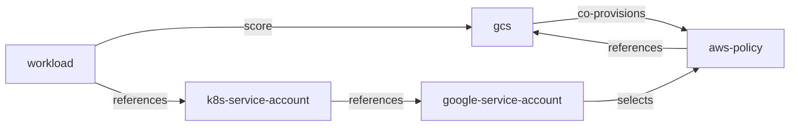
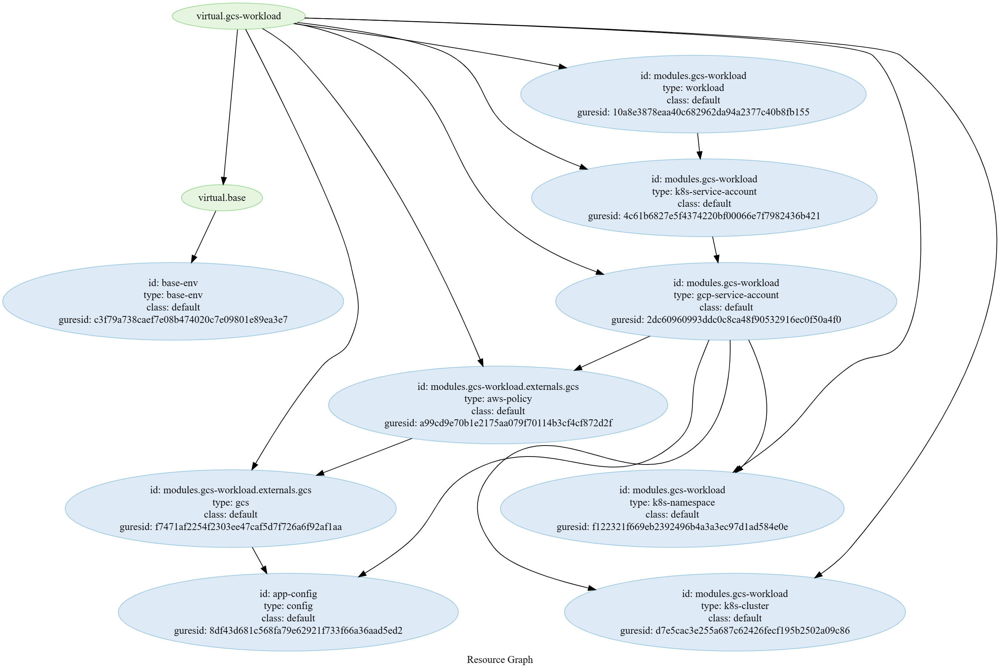
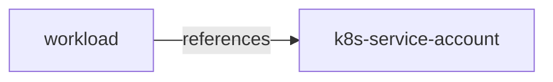
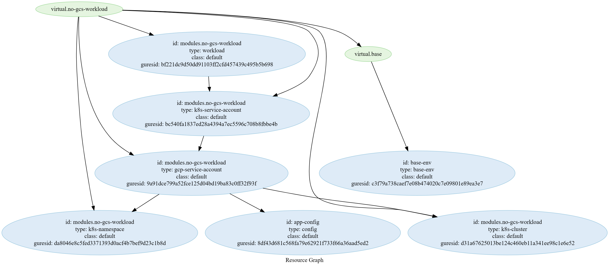
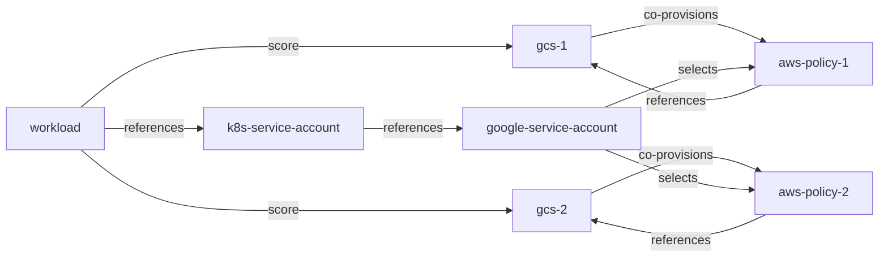
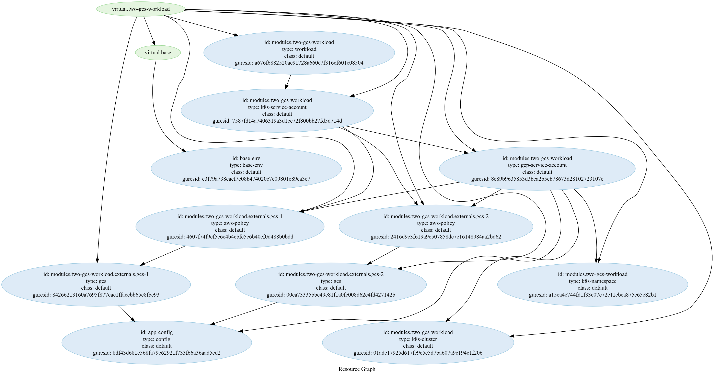

# Tests

```bash
APP=FIXME
ENVIRONMENT=FIXME
```

## Deploy with GCS



```bash
make with-gcs
```

Should get successfull requests in the logs:
```bash
kubectl logs \
    -l app.kubernetes.io/name=gcs-workload \
    -n ${ENVIRONMENT}-${APP}
```

Should return a KSA with the WI annotation:
```bash
kubectl get sa gcs-workload \
    -n ${ENVIRONMENT}-${APP} \
    -o yaml
```

Should return a GSA:
```bash
gcloud iam service-accounts list | grep gcs-workload
```

Should retourn a GCS:
```bash
gcloud storage buckets list \
    | grep $(humctl get active-resources \
        --env ${ENVIRONMENT} \
        --app ${APP} \
        -o json \
        | jq '. | map(. | select(.metadata.type == "gcs" and .metadata.res_id == "modules.gcs-workload.externals.gcs"))' \
        | jq -r .[0].status.resource.name)
```

Generated resource graph:


## Deploy without GCS



```bash
make without-gcs
```

Should return a KSA without the WI annotation:
```bash
kubectl get sa no-gcs-workload \
    -n ${ENVIRONMENT}-${APP} \
    -o yaml
```

Shouldn't return a GSA:
```bash
gcloud iam service-accounts list | grep no-gcs-workload
```

Generated resource graph:


## Deploy with 2 GCS



```bash
make with-2-gcs
```

Should get successfull requests in the logs:
```bash
kubectl logs \
    -l app.kubernetes.io/name=two-gcs-workload \
    -n ${ENVIRONMENT}-${APP}
```

Should return a KSA with the WI annotation:
```bash
kubectl get sa two-gcs-workload \
    -n ${ENVIRONMENT}-${APP} \
    -o yaml
```

Should return a GSA:
```bash
gcloud iam service-accounts list | grep two-gcs-workload
```

Should retourn a 1st GCS:
```bash
gcloud storage buckets list \
    | grep $(humctl get active-resources \
        --env ${ENVIRONMENT} \
        --app ${APP} \
        -o json \
        | jq '. | map(. | select(.metadata.type == "gcs" and .metadata.res_id == "modules.two-gcs-workload.externals.gcs-1"))' \
        | jq -r .[0].status.resource.name)
```

Should retourn a 2nd GCS:
```bash
gcloud storage buckets list \
    | grep $(humctl get active-resources \
        --env ${ENVIRONMENT} \
        --app ${APP} \
        -o json \
        | jq '. | map(. | select(.metadata.type == "gcs" and .metadata.res_id == "modules.two-gcs-workload.externals.gcs-2"))' \
        | jq -r .[0].status.resource.name)
```

Generated resource graph:
